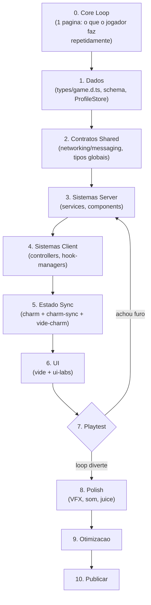

# Fluxo de Desenvolvimento

Checklist fixo pra usar em todo projeto novo nesse template. Objetivo: nunca travar no meio por falta de ordem, e terminar o projeto no menor tempo com sistemas bem casados entre si.

## Regra de ouro

**1 core loop pequeno e completo (dado → server → client → UI) vale mais que 10 sistemas pela metade.**

Fóruns de Roblox, Unity e Unreal convergem no mesmo ponto: a causa nº1 de projeto que nunca termina é *scope creep* — abrir sistema novo antes do atual estar de ponta a ponta. Mais de 70% dos indies que abandonam projeto citam "escopo grande demais" como motivo. A solução recomendada é a **vertical slice**: um pedaço pequeno do jogo, mas completo e polido, antes de expandir.

No Roblox especificamente, o Developer Forum recomenda decidir a arquitetura (organização de módulos, DataStore, services) **antes** de escrever a feature — não durante.

## Fluxograma



## Fases

### 0. Core loop
Escreve em 1 página: qual ação o jogador repete, por que é divertida, qual a referência mecânica mais próxima. Não abre o editor ainda.

### 1. Dados primeiro
Já é o hábito. Continua assim — fóruns concordam que decidir o *shape* do dado antes evita retrabalho em cascata.
- Schema do player em `types/game.d.ts`
- Template de perfil em `src/server/services/profile.ts` (ProfileStore)
- Versionamento/migração do save já pensado aqui, não depois

### 2. Contratos shared
- Eventos/remotes em `src/shared/messaging.ts` (Flamework networking)
- Tipos compartilhados em `types/global.d.ts`
- Utils puros (`src/shared/utils/*`) que server e client vão usar

### 3. Sistemas server
Lógica autoritativa primeiro, sem nenhuma UI. Server valida tudo — client nunca é fonte de verdade.
- `src/server/services/*`, `src/server/components/*`

### 4. Sistemas client
Consome o que o server manda. Ainda sem UI bonita — só confirma que o dado chega certo.
- `src/client/controllers/*`, `src/client/hook-managers/*`

### 5. Estado sincronizado
Liga client e server via `@rbxts/charm` + `charm-sync` + `vide-charm`. Esse é o "cano" entre os dois lados — só depois dele a UI tem algo real pra mostrar.

### 6. UI
Constrói em cima do estado que já existe e já está sincronizado — nunca com dado mockado que depois precisa ser trocado.
- `src/client/ui/*` (vide, ui-labs pra prototipar componente isolado)

### 7. Playtest
Joga. Se achou furo, volta pra fase 3 (sistemas server) — não pra fase 0. Se o loop diverte, segue.

### 8. Polish
Só entra aqui: VFX, shaders, juice (`rainbow-shadow-effect.ts`, `shiny-effect.ts`), som, câmera shake, etc.

### 9. Otimização
Profiling, redução de rede (binary-serializer), lazy load.

### 10. Publicar
Checklist final de release.

## Regra anti-trava

- **Nunca dois sistemas grandes em paralelo.** Termina um (fases 1→7) antes de abrir outro.
- Sistema só é "pronto" quando passa as 4 camadas: **dado existe → server valida → client reflete → UI mostra**. Se travar, pergunta qual dessas 4 falta — geralmente é só uma.
- Feature nova surgiu na cabeça? Pergunta: "isso quebra ou reforça o core loop?" Se não reforça, vai pro backlog, não pro código.
- Não decora fase 8/9 (polish/otimização) num sistema que ainda não passou no playtest da fase 7. Polish em sistema que pode ser cortado é tempo jogado fora.

## Checklist por sistema novo

```
[ ] Dado (schema/type em types/)
[ ] Contrato shared (evento/remote em messaging.ts)
[ ] Server valida (service/component)
[ ] Client reflete (controller)
[ ] Estado sincronizado (charm)
[ ] UI (vide)
[ ] Testado manualmente em Studio
[ ] Polish (opcional, só se sistema sobreviveu ao playtest)
```

## Fontes

- [Software Architecture for Roblox Programming — Roblox DevForum](https://devforum.roblox.com/t/software-architecture-for-roblox-programming-a-quick-guide/302278)
- [Scope Creep in Indie Games — Wayline](https://www.wayline.io/blog/scope-creep-indie-games-avoiding-development-hell)
- [Why Your Indie Game Needs a Vertical Slice — Indie Bandits](https://indiebandits.com/2023/02/13/why-your-indie-game-needs-a-vertical-slice/)
- [Vertical Slice in Game Development — Tono Game Consultants](https://tonogameconsultants.com/vertical-slice/)
- [Community Tutorial: Unreal Engine Development Workflow — Epic Dev Community Forums](https://forums.unrealengine.com/t/community-tutorial-my-unreal-engine-development-workflow-from-core-idea-to-playable-build/2729913)
- [Build on your basic prototype — Unity Learn](https://learn.unity.com/pathway/creative-core/unit/prototyping/tutorial/build-on-your-basic-prototype-3)
